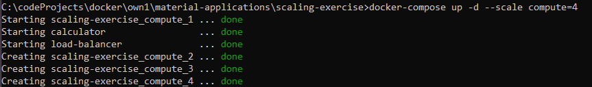

### Exercise  1 ###
[docker-compose](./docker-compose2.1.yml)

### Exercise  2 ###
[docker-compose](./docker-compose2.2.yml)

### Exercise  3 ###
[docker-compose](./docker-compose2.3.yml)

### Exercise  4 ###
[docker-compose](./docker-compose2.4.yml)

### Exercise  5 ###

### Exercise  6 ###
[docker-compose](./docker-compose2.6.yml)

### Exercise  7 ###
[docker-compose](./docker-compose2.7.yml)

### Exercise  8 ###
[docker-compose](./docker-compose2.8.yml)

### Exercise  9 ###
[docker-compose](./docker-compose2.9.yml)

### Exercise  10 ###
[docker-compose](./docker-compose2.10.yml)

[Dockerfile for frontend](./DockerfileFrontend10)

[Dockerfile for backend](./DockerfileBackend10)

